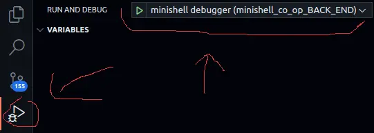

# Minishell BACK_END

- [subject](doc/subject.md)
- [allowed functions](doc/allowed_functions.md)
- [implementation](doc/implementation.md)
- [cmd_structure_rules](doc/cmd_structure_rules.md)
- [minishell subject](doc/minishell.pdf)

## Overview
This branch is the stand alone "backend" part of the minishell project. It's job is to execute (*pipe*) the commands which have been read and parsed (*front_end*) form the user.  
NOTE: there are only test functions which simulate the data, which will be available from the "front end".  

- execute `t_cmd list` as pipe if it has more than one node
- save the "**exit status**" of the last command in `t_data.exit_status`
- execute builtin commands (*[see subject](doc/minishell.pdf)*) `t_data.builtin_fun` which will be available as function pointers
- handle signals `ctrl-C, ctrl-D and ctrl-\`

## Front End API
All data is stored in the `t_data` structure which is often passed as pointer `*d`. It contains a linked list with all the parsed commands `t_cmd` (*each node represents one command*).

```c
typedef struct s_cmd
{
	ptr_builtin		builtin_fun;	// function pointer for builtin
	char			*cmd_path;		// MALLOC!! path + /cmd (one string)
	char			**cmd_arg;		// MALLOC!! tab[0]=cmd; tab[1]=args; tab[2]=NULL
	int				fd_f_in;		// file descriptor for direct-in files
	int				fd_f_out;		// file descriptor for direct-out files
	bool			is_tmp_file_in;	// true, remove file after use
	char			*f_in;			// MALLOC!! direct-in file name
	char			*f_out;			// MALLOC!! direct-out file name
	struct s_cmd	*prev;			// previous node in the list
	struct s_cmd	*next;			// next node in the list
}	t_cmd;
```

## Test Data
Every time the  
`TEST_add_node("/usr/bin/ls", "ls,-l,-a", "file_in", "file_out", d);`  
is called a new node is added to the `t_cmd` structure.  
- 1st argument is the path to the command
- 2nd argument is a list of command and arguments which are separated with `,`
- name of the direct-in file, (*if not exist, it is created, not real bash throw error*)  
- name of the direct-out file, (*if not exist, it is created, otherwise it is read*)
- `d` is the pointer to the structure `t_data`

## Debugging
The folder `.vscode/launch.json` contains the settings for debugging on vscode (*executable `minishell` must exist*).  

